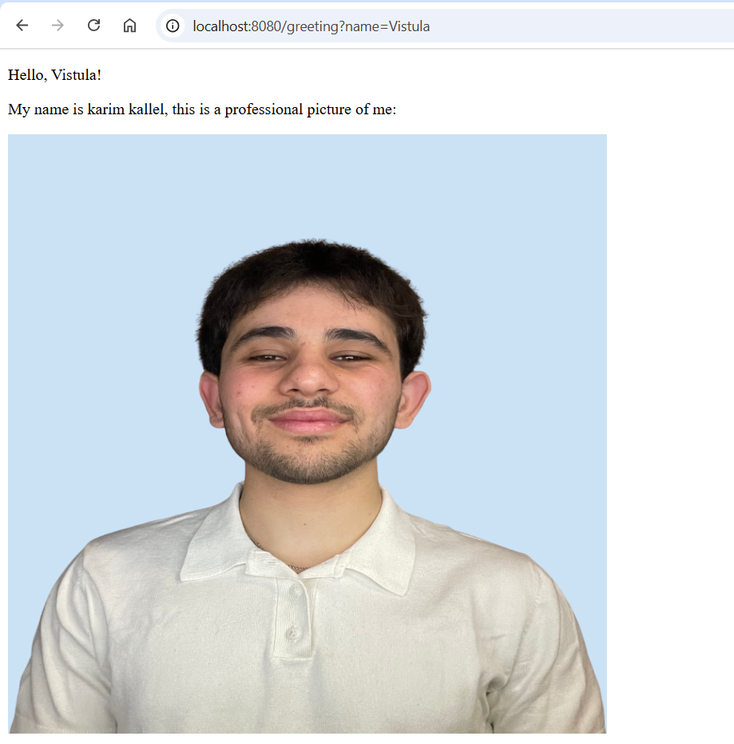
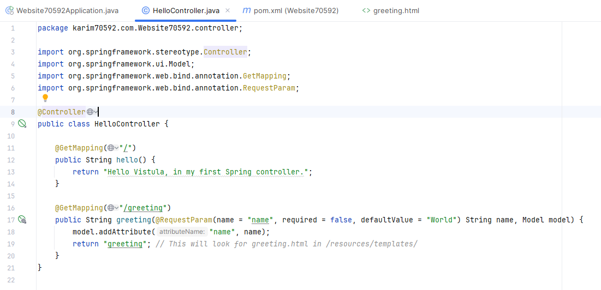

# Spring Boot Greeting App

## 📋 Description
This Java Spring Boot application demonstrates the use of the MVC design pattern.

- It uses a controller to handle HTTP requests.
- Displays a personalized greeting based on a URL parameter.
- Shows an image loaded from the `static` folder.
- Uses Thymeleaf as a view template engine.

## ▶️ How to Run
1. Open the project in IntelliJ IDEA.
2. Run the `Website70592Application.java` file.
3. In your browser, go to:
   http://localhost:8080/greeting?name=world

## 📸 Screenshots

### 🖥️ Running Application

This screenshot shows the app working in the browser:

### Greeting Page with Name:

### Project Structure:

### Controller Code:

## 🗂️ Project Structure
- **Controller:** `HelloController.java`
- **View Template:** `greeting.html` in `resources/templates`
- **Image:** in `resources/static/images/121.jpeg`

## 🧑‍💻 Author
Karim kallel

## 🌐 URL Parameter Example
To test the name parameter, try:
http://localhost:8080/greeting?name=Anna
